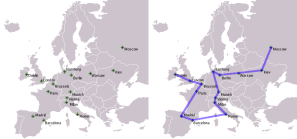
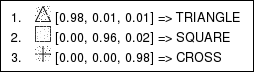

# AI4R :: Artificial Intelligence for Ruby

## Introduction

AI4R is a collection of ruby algorithm implementations, covering several Artificial intelligence fields, and simple practical examples using them. A Ruby playground for AI researchers. It implements:

- [Genetic algorithms](https://www.rubydoc.info/gems/ai4r/Ai4r/GeneticAlgorithm)
- [Self-organized maps (SOM)](https://www.rubydoc.info/gems/ai4r/Ai4r/Som)
- [Neural Networks](https://www.rubydoc.info/gems/ai4r/Ai4r/NeuralNetwork)
  - [Multilayer perceptron with Backpropagation learning](https://www.rubydoc.info/gems/ai4r/Ai4r/NeuralNetwork/Backpropagation)
  - [Hopfield net](https://www.rubydoc.info/gems/ai4r/Ai4r/NeuralNetwork/Hopfield)
- [Automatic classifiers (Machine Learning)](machine-learning.md)
  - [ID3 (Decision Trees)](https://www.rubydoc.info/gems/ai4r/Ai4r/Classifiers/ID3)
  - [PRISM (J. Cendrowska, 1987)](https://www.rubydoc.info/gems/ai4r/Ai4r/Classifiers/Prism)
  - [Multilayer Perceptron](https://www.rubydoc.info/gems/ai4r/Ai4r/Classifiers/MultilayerPerceptron)
  - [OneR (AKA One Attribute Rule, 1R)](https://www.rubydoc.info/gems/ai4r/Ai4r/Classifiers/OneR)
  - [ZeroR](https://www.rubydoc.info/gems/ai4r/Ai4r/Classifiers/ZeroR)
  - [Hyperpipes](https://www.rubydoc.info/gems/ai4r/Ai4r/Classifiers/Hyperpipes)
  - [Naive Bayes](https://www.rubydoc.info/gems/ai4r/Ai4r/Classifiers/NaiveBayes)
  - [IB1 (D. Aha, D. Kibler - 1991)](https://www.rubydoc.info/gems/ai4r/Ai4r/Classifiers/IB1)
- [Data clustering](https://en.wikipedia.org/wiki/Data_clustering)
  - [K-means](https://en.wikipedia.org/wiki/k_means)
  - [Bisecting k-means](https://en.wikipedia.org/wiki/k_means)
  - [Single linkage](https://www.rubydoc.info/gems/ai4r/Ai4r/Clusterers/SingleLinkage)
  - [Complete linkage](https://www.rubydoc.info/gems/ai4r/Ai4r/Clusterers/CompleteLinkage)
  - [Average linkage](https://www.rubydoc.info/gems/ai4r/Ai4r/Clusterers/AverageLinkage)
  - [Weighted Average linkage](https://www.rubydoc.info/gems/ai4r/Ai4r/Clusterers/WeightedAverageLinkage)
  - [Centroid linkage](https://www.rubydoc.info/gems/ai4r/Ai4r/Clusterers/CentroidLinkage)
  - [Median linkage](https://www.rubydoc.info/gems/ai4r/Ai4r/Clusterers/MedianLinkage)
  - [Ward's method linkage](https://www.rubydoc.info/gems/ai4r/Ai4r/Clusterers/WardLinkage)
  - [Diana (Divisive Analysis)](https://www.rubydoc.info/gems/ai4r/Ai4r/Clusterers/Diana)

## Practical Examples

### Genetic Algorithms
[Optimization of the Travelling salesman problem (NP-hard problem)](genetic-algorithms.md)



### Neural Networks
[Simple OCR (recognition of visual patterns)](neural-networks.md)



### Automatic Classifiers
[Automatic identification of relevant marketing targets](machine-learning.md)

## How to Install

1. Install the gem:
```bash
gem install ai4r
```

2. Include require statements in your code:
```ruby
require "rubygems"
require "ai4r"
```

## Contact

If you have questions or constructive comments about this project, send it to me: [Sergio Fierens](https://github.com/SergioFierens), email address: sergio (dot) fierens (at) gmail (dot) com.

## Contributors

This project was created and is maintained by [Sergio Fierens](https://github.com/SergioFierens). There are other (great and absolutely cool) people who have donated time and code to make this project better, including:

- Thomas Kern
- Luis Parravicini
- Kevin Menard

## Disclaimer Note

This software is provided "as is" and without any express or implied warranties, including, without limitation, the implied warranties of merchantibility and fitness for a particular purpose.