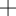
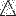
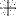
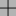
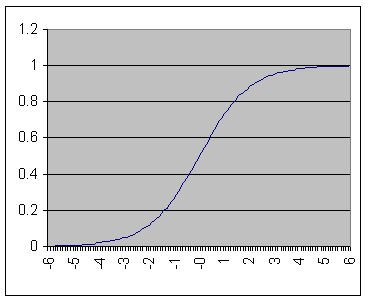

# OCR Example using Backpropagation Networks in Ruby :: AI4R

## Introduction to Neural Networks

The utility of artificial neural network models lies in the fact that they can be used to infer a function from observations. This is particularly useful in applications where the complexity of the data or task makes the design of such a function by hand impractical. Neural Networks are being used in many businesses and applications. Their ability to learn by example makes them attractive in environments where the business rules are either not well defined or are hard to enumerate and define. Many people believe that Neural Networks can only solve toy problems. Give them a try, and let you decide if they are good enough to solve your needs.

In this module you will find an implementation of neural networks using the Backpropagation is a supervised learning technique (described by Paul Werbos in 1974, and further developed by David E. Rumelhart, Geoffrey E. Hinton and Ronald J. Williams in 1986).

## Modeling the OCR problem using Neural Networks

Let's imagine that we have to implement a program to identify simple patterns (triangles, squares, crosses, etc). The main problem is that this program must be resistant to random noise in the image (pixels with wrong values) and line noise (similar to the unwanted direct current that we usually have in a signal).

In order to solve this problem, we can take an example of each pattern to be recognized, and train a neural network to identify similar patterns. In fact, one of the most popular uses of neural networks in business applications is OCR (optical character recognition).

In our proposed solution, we create a network with the following architecture: 256 input neurons and 3 output neurons. We feed this network with 16x16 matrices (in fact will convert them to vectors of length 256). Each pixel is represented with a number from 0 (white pixel) to 10 (black pixel). The output of this network is a 3 vector of dimension 3, where ideally:

- (1, 0, 0) for triangles
- (0, 1, 0) for squares
- (0, 0, 1) for crosses

We train our backpropagation neural network using the following examples:

### Training patterns

| Triangle | Square | Cross |
|----------|--------|-------|
|  |  |  |

## Implementing a basic OCR application using ruby and AI4R

The code below shows the basic steps to use Backpropagation Neural Networks in AI4R:

```ruby
# Create the network with:
#   4 inputs
#   1 hidden layer with 3 neurons
#   2 outputs
net = Ai4r::NeuralNetwork::Backpropagation.new([4, 3, 2])  

# Train the network
100.times do |i|
  net.train(example[i], result[i])
end

# Use it: Evaluate data with the trained network
net.eval([12, 48, 12, 25])  # =>  [0.89, 0.04]
```

This is the source code used to elaborate this simple OCR application (You can find it inside the AI4R zip file release):

```ruby
require "rubygems"
require "ai4r"
require File.dirname(__FILE__) + '/training_patterns'
require File.dirname(__FILE__) + '/patterns_with_noise'
require File.dirname(__FILE__) + '/patterns_with_base_noise'

# Create a network with 256 inputs, and 3 outputs
net = Ai4r::NeuralNetwork::Backpropagation.new([256, 3])

# Load training data
tr_input = TRIANGLE.flatten.collect { |input| input.to_f / 10}
sq_input = SQUARE.flatten.collect { |input| input.to_f / 10}
cr_input = CROSS.flatten.collect { |input| input.to_f / 10}

# Train the network
puts "Training the network, please wait."
100.times do
  net.train(tr_input, [1,0,0])
  net.train(sq_input, [0,1,0])
  net.train(cr_input, [0,0,1])
end

# Load test data with noise
tr_with_noise = TRIANGLE_WITH_NOISE.flatten.collect { |input| input.to_f / 10}
sq_with_noise = SQUARE_WITH_NOISE.flatten.collect { |input| input.to_f / 10}
cr_with_noise = CROSS_WITH_NOISE.flatten.collect { |input| input.to_f / 10}

tr_with_base_noise = TRIANGLE_WITH_BASE_NOISE.flatten.collect { |input| input.to_f / 10}
sq_with_base_noise = SQUARE_WITH_BASE_NOISE.flatten.collect { |input| input.to_f / 10}
cr_with_base_noise = CROSS_WITH_BASE_NOISE.flatten.collect { |input| input.to_f / 10}

# Print the evaluation results

def result_label(result)
  if result[0] > result[1] && result[0] > result[2]
    "TRIANGLE"
  elsif result[1] > result[2] 
    "SQUARE"
  else    
    "CROSS"
  end
end

puts "Training Examples"
puts "#{net.eval(tr_input).inspect} => #{result_label(net.eval(tr_input))}"
puts "#{net.eval(sq_input).inspect} => #{result_label(net.eval(sq_input))}"
puts "#{net.eval(cr_input).inspect} => #{result_label(net.eval(cr_input))}"
puts "Examples with noise"
puts "#{net.eval(tr_with_noise).inspect} => #{result_label(net.eval(tr_with_noise))}"
puts "#{net.eval(sq_with_noise).inspect} => #{result_label(net.eval(sq_with_noise))}"
puts "#{net.eval(cr_with_noise).inspect} => #{result_label(net.eval(cr_with_noise))}"
puts "Examples with base noise"
puts "#{net.eval(tr_with_base_noise).inspect} => #{result_label(net.eval(tr_with_base_noise))}"
puts "#{net.eval(sq_with_base_noise).inspect} => #{result_label(net.eval(sq_with_base_noise))}"
puts "#{net.eval(cr_with_base_noise).inspect} => #{result_label(net.eval(cr_with_base_noise))}"
```

## Results obtained with the AI4R OCR algorithm

The results we got when we evaluate patterns with our trained network are:

### Evaluating the training patterns with the trained network:

1.  [0.98, 0.03, 0.01] => TRIANGLE
2.  [0.00, 0.96, 0.03] => SQUARE
3.  [0.00, 0.00, 0.99] => CROSS

### Evaluating the patterns with random noise with the trained network:

1.  [0.98, 0.01, 0.01] => TRIANGLE
2.  [0.00, 0.96, 0.02] => SQUARE
3.  [0.00, 0.00, 0.98] => CROSS

### Evaluating the patterns with line noise with the trained network:

1.  [0.62, 0.00, 0.02] => TRIANGLE
2.  [0.00, 0.75, 0.01] => SQUARE
3.  [0.00, 0.00, 0.98] => CROSS

These results are satisfactory. The network could successfully identify the patterns despite the noise introduced to them.

## Customizing your neural network in AI4R

Sometimes for a given problem, you will have to "play around" with some parameters to get to a solution. These parameters are:

**Learning Rate**: a real number, usually between 0.05 and 0.25.

**Momentum**: A momentum will avoid oscillations during learning, converging to a solution in less iterations.

**Propagation function**: By default, f(x) = 1/(1 + e^(-x)). This function is called [Sigmoid function](http://en.wikipedia.org/wiki/Sigmoid_function). You can see it like a "smoothed" version of the [Heaviside step function](http://en.wikipedia.org/wiki/Heaviside_step_function). It will always provide a value between 0 and 1.



Sometimes you will have better results with f(x) = tanh(x), or even with f(x) = x. If you modify the propagation function, you have to supply the derivative function too (in terms of the propagation function result).

To customize these parameters in AI4R, you can use the "set_parameters" method:

```ruby
net.set_parameters( 
  :momentum => 0.15, 
  :learning_rate => 0.5,
  :propagation_function => lambda { |x| Math.tanh(x) },
  :derivative_propagation_function => lambda { |y| 1.0 - y**2 }
)
```

You can also use the attribute accessors:

```ruby
net.momentum = 0.15 
net.learning_rate = 0.5
net.propagation_function = lambda { |x| Math.tanh(x) }
net.derivative_propagation_function = lambda { |y| 1.0 - y**2 }
```

> **Note**: Remember to set the custom parameters BEFORE training the network

## More about Neural Networks and Backpropagation

- [Wikipedia article on Artificial Neural Networks](http://en.wikipedia.org/wiki/Artificial_neural_network)
- [Wikipedia article on Backpropagation Algorithm](http://en.wikipedia.org/wiki/Backpropagation)
- [Neural Networks - An Introduction by Abdul Habra](http://www.tek271.com/articles/neuralNet/IntoToNeuralNets.html)
- [A graphical explanation of the backpropagation algorithm by Mariusz Bernacki and Przemysław Włodarczyk](http://galaxy.agh.edu.pl/~vlsi/AI/backp_t_en/backprop.html)